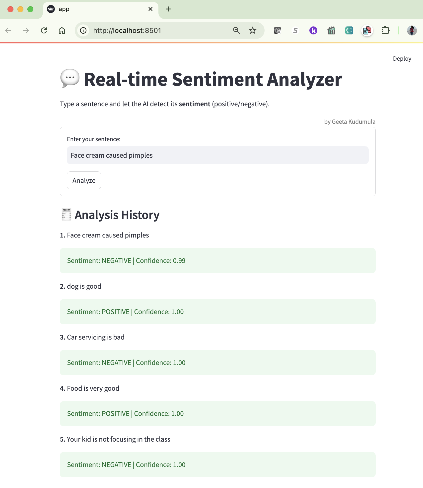

# 💬 Real-time Sentiment Analyzer (Streamlit + Hugging Face)

A real-time, interactive sentiment analysis web app built using **Streamlit** and **Hugging Face Transformers**. This app allows users to enter custom sentences and instantly get back a prediction of the sentence's **sentiment** — either **POSITIVE** or **NEGATIVE** — along with a confidence score.

> ⚡ Powered by `distilbert-base-uncased-finetuned-sst-2-english`  
> 👩‍💻 Created by **Geeta Kudumula**, Technical AI/ML Architect

# 💬 Real-time Sentiment Analyzer
_Instantly detect the tone of any sentence using AI-powered Transformers_

---

## ✨ Overview
A real-time, interactive web app that classifies user-input sentences as **positive** or **negative** using `distilbert-base-uncased-finetuned-sst-2-english` from **Hugging Face Transformers**. Built using **Streamlit**, it displays sentiment labels and confidence scores with a clean UI.

> ✨ Powered by: `distilbert-base-uncased-finetuned-sst-2-english`  
> 🚀 Created by **Geeta Kudumula**, Technical AI/ML Architect

---

## 🔬 Purpose
This app is ideal for:
- Customer support teams analyzing feedback
- Developers testing chatbot sentiment
- Product reviews classification
- Educators reviewing student reflections

---

## 🚀 Demo


Try inputs like:
- `The service was excellent and fast!`
- `This product made things worse.`
- `It's okay, not the best but not the worst.`

---

## 💡 Features
- ✅ Real-time sentiment analysis
- 📅 Live analysis history with emoji feedback
- 🚀 Confidence score
- 🌈 Personalized UI ("by Geeta Kudumula")
- ✏️ Clean and responsive design (Streamlit UI)

---

## 🔧 Under the Hood
- **🌎 Model:** `distilbert-base-uncased-finetuned-sst-2-english` (Hugging Face)
- **🎓 Framework:** Python + [Streamlit](https://streamlit.io/) for frontend
- **📊 Libraries:** `transformers`, `torch`, `streamlit`

---

## 🚀 How to Run This Locally
```bash
# 1. Clone the repo
git clone https://github.com/geetakudumula/real-time-sentiment-analyzer-streamlit.git
cd real-time-sentiment-analyzer-streamlit

# 2. Create & activate virtual environment (optional but recommended)
python3 -m venv venv
source venv/bin/activate

# 3. Install dependencies
pip install -r requirements.txt

# 4. Run the app
streamlit run app.py
```

---

## 📊 Example
```yaml
Sentence: "This feature is terrible and slow."
Sentiment: NEGATIVE
Confidence: 1.00
```

---

## 👤 Author
Built with ❤️ by **Geeta Kudumula**  
Technical AI/ML Architect ❘ Streaming Expert ❘ Cloud Practitioner  
[LinkedIn Profile](https://www.linkedin.com/in/geetakudumula/) ❘ [My Hugging Face Page](https://huggingface.co/geetakudumula)

---

## 🌐 License
This project is open-source under the MIT License.


